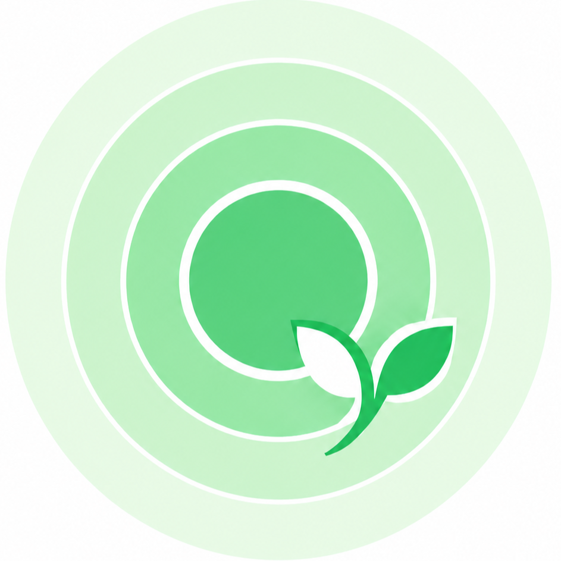
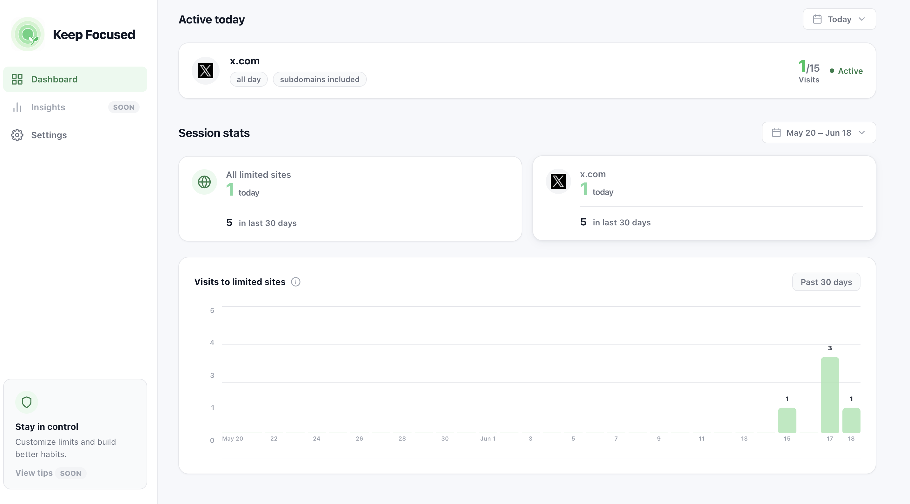

  

<h1 align="center">Keep Focused</h1>

  一款轻量级 Chrome 扩展，通过域名、日程和每日会话次数来拦截让人分心的网站。

---

## 为什么用 Keep Focused？

分心往往只需要一次点击。**Keep Focused** 通过简单灵活的规则，在你和干扰源之间筑起一道屏障，帮助你保持专注。

### 保护隐私

大多数网站拦截工具由第三方开发，需要读取你访问的每一个页面。这意味着它们可能看到：

- 你打开的每个 URL
- 你访问特定网站的时间和频率
- 你长期的浏览习惯

有些扩展还会把这些数据发送到远程服务器，用于分析、账户同步，甚至变现。即使是知名工具，也可能更换所有者或修改隐私政策。

**Keep Focused 的诞生，是因为我想要一个可以完全信任的拦截工具。** 它是开源的，完全在你的浏览器内运行，所有数据——规则、使用量、设置——都保存在 Chrome 本地存储中。没有账户、没有云同步、没有分析、没有远程服务器。只要你能读代码，就知道它做了什么。

### 灵活，而非一刀切

与完全禁止不同，你可以自己决定：

- **哪些域名**是干扰源。
- **什么时间**拦截它们（指定星期和时段）。
- **每天允许自己查看几次**（每日会话上限）。

## 功能

- 🔒 **基于域名拦截** — 规范化匹配域名，`https://domain.com/path` 和 `https://www.domain.com` 会被视为同一规则。
- 🌐 **子域名支持** — 每条规则可选择是否包含 `forum.domain.com` 等子域名。
- 📅 **定时规则** — 选择生效星期，并可设置限制时段。
- 🔢 **会话限制** — 设置每日可查看次数，同一会话窗口内的重复访问只算一次。
- 📊 **准确的每日统计** — 追踪真实的每日会话数，包括重置今日额度后使用的会话。
- ⚡ **总开关** — 在 popup 中快速开启或关闭所有拦截。
- 🎯 **限时专注模式** — 在 popup 中锁定当前页面一段时间。默认 30 分钟，可在 popup 或设置页调整，popup 关闭后也会在时间结束时自动解除锁定。
- 🔒 **隐私优先** — 所有数据留在浏览器内，没有账户、没有服务器、没有追踪。

## 展示

  

## 安装

1. 克隆或下载本仓库。
2. 打开 Chrome，进入 `chrome://extensions`。
3. 开启右上角的**开发者模式**。
4. 点击**加载已解压的扩展程序**。
5. 选择本项目文件夹。
6. 打开扩展设置，添加你的第一条规则。

## 使用示例

**在指定日期限制为 5 次会话**

| 域名 | 星期 | 时间 | 会话数 | 效果 |
|---|---|---|---|---|
| `tradingview.com` | 周一 / 周二 / 周日 | 全天 | 5 | 这些日期允许 5 次查看会话，用完后拦截到次日。 |

**在工作时段屏蔽某个网站**

| 域名 | 星期 | 时间 | 会话数 | 效果 |
|---|---|---|---|---|
| `reddit.com` | 周一至周五 | 09:00–17:00 | 0 | 工作日工作时段完全拦截 Reddit，其他时段放行。 |

## 权限说明

Keep Focused 只申请完成工作所必需的最小权限：

- `storage` — 在本地保存你的规则和设置。
- `tabs` / `webNavigation` — 检测页面导航并统计会话。
- `alarms` — 在限时专注模式到点时唤醒后台 service worker，确保 popup 关闭后也能自动解除锁定。
- `notifications` — 当专注模式把你切回锁定页面、但 popup 未能自动弹出时，用系统通知告诉你原因。
- `host_permissions: <all_urls>` — 读取页面 URL，以便规则可以匹配你选择的任意域名。

## 许可证

MIT
